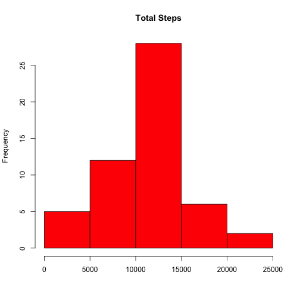

    
## Introduction
    
As a part of the Reproducible Research course, the purpose of Peer Assessment 1 was to explore and plot the data generated by activity monitors, such as a pedometer, in a reproducible fashion.  However, the depth of exploration was fairly limited.  Therefore, this Shiny App allows for deeper exploration of the data from that assignment.

Try out the app yourself here: <a href="https://jbrown.shinyapps.io/App-DataProduct/">https://jbrown.shinyapps.io/App-DataProduct/</a>!
    

---
    
## Source Data
    
The source data for this assignment was originally downloaded from the Reproducible Research course web site:
    
Dataset: <a href="https://d396qusza40orc.cloudfront.net/repdata%2Fdata%2Factivity.zip">Activity monitoring data</a> [52K]

The variables included in this dataset are:
    
- steps: Number of steps taking in a 5-minute interval (missing values are coded as NA)

- date: The date on which the measurement was taken in YYYY-MM-DD format

- interval: Identifier for the 5-minute interval in which measurement was taken

The dataset is stored in a comma-separated-value (CSV) file and there are a total of 17,568 observations in this dataset.

---
    
## How it works
    
1. Once the app is running, select one of the histograms.
2. Select one of the line graphs.
3. Filter the data based on which day or days of the week you would like to explore, as below:
    

  

    <form class="well">
      

        <label class="control-label" for="days">Select the days to apply to the plots:</label>
        <label class="checkbox ">
          <input type="checkbox" name="days" id="days1" value="Monday" checked="checked"/>
          Monday
        </label>
        <label class="checkbox ">
          <input type="checkbox" name="days" id="days2" value="Tuesday" checked="checked"/>
          Tuesday
        </label>
        <label class="checkbox ">
          <input type="checkbox" name="days" id="days3" value="Wednesday" checked="checked"/>
          Wednesday
        </label>
        <label class="checkbox ">
          <input type="checkbox" name="days" id="days4" value="Thursday" checked="checked"/>
          Thursday
        </label>
        <label class="checkbox ">
          <input type="checkbox" name="days" id="days5" value="Friday" checked="checked"/>
          Friday
        </label>
        <label class="checkbox ">
          <input type="checkbox" name="days" id="days6" value="Saturday" checked="checked"/>
          Saturday
        </label>
        <label class="checkbox ">
          <input type="checkbox" name="days" id="days7" value="Sunday" checked="checked"/>
          Sunday
        </label>
      

    </form>
  

  

    <h3>You have selected the following days:</h3>
    <h4 id="text1" class="shiny-html-output"></h4>
     
    <h3>The mean of the steps based on days selected is:</h3>
    <h4 id="text2" class="shiny-html-output"></h4>
  

Note: the overall mean of the steps taken is calculated based on what days are selected, too.

---

## Shiny App Version

<iframe src="https://jbrown.shinyapps.io/App-tiny/" style="border: none; width: 600px; height: 400px"></iframe>

---
    
## Example Plot

 

